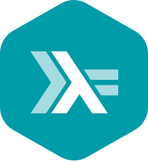

## Lenguajes de Programación

### Información general

**Grupo 302**

**Profesor:** L. en C.C. Manuel Soto Romero  
Martes 19 a 22 hrs. Aula A-005   
Viernes 19 a 20:30 hrs. Aula A-005

### Descripción

Lenguajes de Programación es una materia indispensable en la Licenciatura en Ingeniería de Software del Colegio de Ciencia y Tecnología en la Universidad Autónoma de la Ciudad de México. Tiene como principal objetivo conocer los fundamentos, principios y aspectos de diseño e implementación de los lenguajes de programación con el fin de que los estudiantes sean capaces de utilizar de modo más adecuado un lenguaje de programación específico y pueda decidir cuál es el más apropiado para utilizarlo en un proyecto de software.						

### Contenido

- [Sesión 1: Introducción a Haskell](sesion01/README.md)
- [Sesión 2: Asignaciones locales y condicionales](sesion02/README.md)
- [Sesión 3: Listas](sesion03/README.md)
