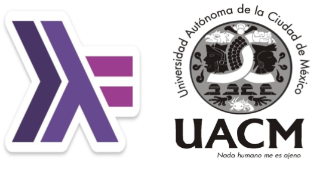

## Lenguajes de Programación

### Información general

**Grupo 302**

**Profesor:** L. en C.C. Manuel Soto Romero  
Martes 19 a 22 hrs. Aula A-005   
Viernes 19 a 20:30 hrs. Aula A-005

### Descripción

Lenguajes de Programación es una materia indispensable en la Licenciatura en Ingeniería de Software del Colegio de Ciencia y Tecnología en la Universidad Autónoma de la Ciudad de México. Tiene como principal objetivo conocer los fundamentos, principios y aspectos de diseño e implementación de los lenguajes de programación con el fin de que los estudiantes sean capaces de utilizar de modo más adecuado un lenguaje de programación específico y pueda decidir cuál es el más apropiado para utilizarlo en un proyecto de software.						

### Contenido

#### Unidad 1: Introducción a Haskell

- [Sesión 1: Introducción a __Haskell__](sesion01/README.md)
- [Sesión 2: Asignaciones Locales y Condicionales](sesion02/README.md)
- [Sesión 3: Estructuras de Datos](sesion03/README.md)

#### Unidad 2: Programación Funcional
- [Sesión 4: Funciones de Primera Clase](sesion04/README.md)
- [Sesión 5: Evaluación Perezosa](sesion05/README.md)
- Sesión 6: Recursión sobre Números
- Sesión 7: Recursión sobre Listas
- Sesión 8: Definición de Intérpretes

#### Unidad 3: Sistemas de Tipos
- Sesión 9: Sistemas de Tipos
- Sesión 10: Definición de Tipos de Datos
- [Sesión 11: Tipos de Datos Recursivos](sesion11/README.md)
- Sesión 12: Verificación de Tipos
- Sesión 13: Inferencia de Tipos

#### Unidad 4: Programación Lógica
- Sesión 14: Introducción a __Prolog__
- Sesión 15: Definición de Reglas
- Sesión 16: Listas

[`Siguiente`](sesion01/README.md)
