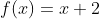
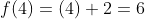

[`Lenguajes de Programación`](../README.md) > `Sesión 1`

## Sesión 1: Introducción a Haskell


__Haskell__ es un lenguaje de programación funcional cuyas principales características son:

- Sin efectos secundarios: No se puede asignar un valor a una variable y luego cambiarlo.
- Transparencia referencial: Si una función es llamada con los mismos parámetros más de una vez, siempre se obtiene el
  mismo valor.
- Evaluación perezosa: No se evalúan expresiones hasta que sea estrictamente necesario.
- Tipificado estáticamente: El tipo de una expresión se conoce en tiempo de compilación.
- Inferencia de tipos: No es necesario etiquetar explícitamente cada expresión con un tipo, el sistema de tipos lo puede
  deducir.

Los lenguajes ubicados dentro de este estilo de programación están basados en mecanismos formales como el Cálculo Lambda
y la Teoría de Categorías que se estudian a profundidan en cursos de Teoría de Lenguajes de Programación y Álgebra 
Moderna.

Existen varias formas de eescribir programas en __Haskell__. En este material se hace uso de la versión interactiva de
__Glasgow Haskell Compiler__ (__GHC__) usando en distintas áreas de la academia y la industria. El material se centra
en __WinGhci__ para __Windows__ pero puede adaptarse sin problemas a otros sistemas operativos.

### :dart: <ins>Instalación de WinGhci</ins>

Para instalar __WinGhci__ basta con ingresar a la dirección https://www.haskell.org/platform/windows.html y descargar
la versión correspondiente. Una vez completada la descarga se debe ejecutar el instalador y dejar las configuraciones
por defecto.

A continuación se describen algunos comandos básicos para usar el intérprete:

Para cargar un archivo:

```
Prelude> :load Archivo.hs
[1 of 1] Compiling Archivo (Archivo.hs, interpreted)
Ok, 1 module loaded.
*Archivo>
```

```
Prelude> :l Archivo.hs
[1 of 1] Compiling Archivo (Archivo.hs, interpreted)
Ok, 1 module loaded.
*Archivo>
```

También puede buscarse el archivo desde la barra de menú y elegirlo directamente de nuestro sistema operativo.

Para recargar un archivo:

```
*Archivo> :reload
Ok, 1 module loaded.
*Archivo>
```

```
*Archivo> :r
Ok, 1 module loaded.
*Archivo>
```

De la misma forma, puede hacerse uso de la barra de menú.

Para conocer información sobre los comandos se tiene el comando `help`:

```
Prelude> :help
Commands available from the prompt:
...
```

```
Prelude> :?
Commands available from the prompt:
...
```

Para salir del intérprete, el comando `quit`:

```
Prelude> :quit
Leaving GHCi
$
```

```
Prelude> :q
Leaving GHCi
$
```

### :dart: <ins>Tipos básicos</ins>

---

> :rocket: **Actividad**    
Abre el intérprete de __Haskell__ y ejecuta todas las expresiones presentadas a continuación. Si tienes dudas con el
resultado de alguna expresión, pregunta al profesor.

---

#### Booleanos (`Bool`)

Representan a las constantes lógicas verdadero (`True`) y falso (`False`).

```
Prelude> True
True
Prelude> False
False
```

#### Números enteros (`Int`, `Integer`)

El tipo `Int` representa números enteros acotados, en máquinas de 32 bits, el valor máximo es `2147483647` y el valor 
mínimo es `-2147483648`.

```
Prelude> 1729
1729
Prelude> (-12)
-12
```

El tipo `Integer` representa números enteros no acotados, es decir, se pueden representar números muy grandes sin que
haya un límite.

```
Prelude> 1234567890097654323574287534897022985718571045781485723478
1234567890097654323574287534897022985718571045781485723478
```

#### Números flotantes (`Float`, `Double`)

El tipo `Float` representa números reales de precisión simple.

```
Prelude> 25.132742
25.132742
```

El tipo `Double` representa número reales de precisión doble.

```
Prelude> 25.12345678923456789
25.12345678923456789
```

#### Caracteres (`Char`)

El tipo `Char` representa caracteres, estos se delimitan por comillas simples.

```
Prelude> 'a'
'a'
```

#### Cadenas (`String`)

El tipo `String` representa secuencias de caracteres delimitadas por comillas dobles.

```
Prelude> "hola"
"hola"
```

### :dart: <ins>Funciones predefinidas</ins>

__Haskell__ provee algunos operadores predefinidos en su núcleo para trabajar con los tipos básicos. Estos operadores 
son en realidad funciones expresadas tanto en forma infija como prefija. Para usar una función en notación prefija se
debe colocar el nombre de la función y separar por espacios sus parámetros y para usarla infijamente se debe colocar 
entre los dos parámetros de la función y delimitar el nombre de la misma por los símbolos \` \`.

---

> :rocket: **Actividad**    
Abre el intérprete de __Haskell__ y ejecuta todas las expresiones presentadas a continuación. Si tienes dudas con el
resultado de alguna expresión, pregunta al profesor.

---

#### Funciones aritméticas

Se listan las principales funciones usadas en aritmética.

| Nombre            | Símbolo | Notación |
| ----------------- | ------- | -------- |
| Suma              | `+`     | Infija   |
| Resta             | `-`     | Infija   |
| Producto          | `*`     | Infija   |
| División (Entera) | `div`   | Prefija  |
| División (Real)   | `/`     | Infija   |
| Potencia (Entera) | `^`     | Infija   |
| Potencia (Real)   | `**`    | Infija   |

```
Prelude> 1 + 2
3
Prelude> 5 - 2
3
Prelude> 10 * 2
20
Prelude> 2 ^ 3
8
Prelude> div 13 2
6
Prelude> 13 `div` 2
6
Prelude> 2.0 ** 3.0
8.0
Prelude> 13 / 2
6.5
```

#### Funciones lógicas

Se listan los principales operadores usados en la lógica matemática, pudiéndose definir otros en términos de éstos.

| Nombre     | Símbolo | Notación |
| ---------- | ------- | -------- |
| Negación   | `not`   | Prefija  |
| Disynción  | `\|\|`  | Infija   |
| Conjunción | `&&`    | Infija   |

```
Prelude> not True
False
Prelude> not False
True
Prelude> True || False
True
Prelude> True && False
False
```

#### Funciones relacionales

Se listan operadores que relacionan números. Estas funciones reciben números, sean enteros o reales y regresan un valor
booleano indicando si se cumple la relación.

| Nombre        | Símbolo | Notación |
| ------------- | ------- | -------- |
| Menor         | `<`     | Infijo   |
| Menor o igual | `<=`    | Infijo   |
| Mayor         | `>`     | Infijo   |
| Mayor o igual | `>=`    | Infijo   |
| Igual         | `==`    | Infijo   |
| Distinto      | `/=`    | Infijo   |

```
Prelude> 10 < 20
True
Prelude> 10 <= 10
True
Prelude> 10 > 2
True
Prelude> 2 >= 2
True
Prelude> 3 == 3
True
Prelude> 3 /= 4
True
```

### :dart: <ins>Definición de funciones</ins>

Además de las funciones predefinidas del lenguaje, es posible definir funciones propias. La sintaxis que se usa para
definir estas funciones es muy parecida a la usada en el área de las matemáticas. Por ejemplo, en matemáticas se puede
definir la siguiente función:



Para usar la función (evaluarla) se sustituye el valor de la entrada por uno concreto:



En __Haskell__ la misma función se puede definir como se muestra a continuación. Las línea 1 y 4 representa comentarios
de varias y una línea respectivamente, usados para documentar el programa. La línea 2 define un módulo y la línea 5 es
la definición como tal de la función.

[`Ejemplo.hs`](codigos/Ejemplo.hs)
```haskell
{- Módulo con ejemplos de definición de funciones -}
module Ejemplo where

   -- Función que toma un número y le suma dos.
   f x = x + 2
```

El código escrito en __Haskell__ se coloca en módulos (bibliotecas) que incluyen definiciones de funciones u otros tipos
de datos. __Haskell__ provee diversos módulos para manipular números, cadenas, funciones de estadística y probabilidad,
álgebra lineal, listas, entre muchas otras. Por convensión el nombre de un módulo debe ser el mismo que el del archivo
donde se definió.

Una vez definido el módulo, se puede cargar en el intérprete para hacer uso de sus funciones.

```
Prelude> :l Ejemplo.hs
[1 of 1] Compiling Ejemplo (Ejemplo.hs, interpreted)
Ok, 1 module loaded.
*Ejemplo> f 4
6
```

---

> :rocket: **Actividad**    
Abre el intérprete de __Haskell__, carga el archivo `Ejemplo.hs` y haz pruebas con la función `f`. Cambia el valor de
entrada de la función y observa los resultados.

---

Para hacer una función más robusta, se especifica una firma o contrato, es decir, cuántos parámetros recibe, de qué tipo
son éstos y qué valor regresa. Es equivalente a especificar el dominio y contradominio de una función en matemáticas.

Para especificar la firma de una función se indica el nombre de la función separado de dos símbolos de dos puntos (`::`),
un espacio y el tipo de sus parámetros, separando los mismso con una flecha (`->`), el último tipo de dato de la firma
representa la salida de la función.

En el siguiente código, la línea 5 representa la firma de la función `f` indicando que la función recibe un número 
entero y regresa otro. La ejecución del código muestra cómo al intentar pasar otro tipo de dato diferente al de la
especificació de la función, se obtiee un error.

[`Ejemplo.hs`](codigos/Ejemplo.hs)
```haskell
{- Módulo con ejemplos de definición de funciones -}
module Ejemplo where

   -- Función que toma un número y le suma dos.
   f :: Int -> Int
   f x = x + 2
```

```
*Ejemplo> f 4.5
<interactive>:2:3: error:
· No instance for (Fractional Int) arising from the literal '4.5'
· In the first argument of 'f', namely '4.5' In the expression: f 4.5 In an equation for 'it': it = 4.5
*Ejemplo> f 4
6
```

---

> :rocket: **Actividad**    
Abre el intérprete de __Haskell__, carga nuevamente el archivo `Ejemplo.hs` y haz pruebas con la función `f`. Cambia el 
valor de entrada de la función, intenta colocar booleanos, caracteres, etc. y observa los resultados.

---

**Ejemplo** En el siguiente código, se define una función para calcular el área total de un cilíndro. La línea 3 
especifica la firma de la función indicando que la función recibe dos parámetros de tipo `Float` y regresa un valor de
tipo `Float`.

[`Ejemplo.hs`](codigos/Ejemplo.hs)
```haskell
-- Función que calcular el área total de un cilíndro data su altura
-- y diámetro.
areaTotal :: Float -> Float -> Float
areaTotal h d = 2 * pi * (d / 2) * (h + (d/2))
```

---

[`Anterior`](../README.md) | [`Siguiente`](../sesion02/README.md)