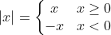

[`Lenguajes de Programación`](../README.md) > `Sesión 2`

## Sesión 2: Asignaciones Locales y Condicionales


### :dart: <ins>Asignaciones locales</ins>

En la Sesión 1, se revisó la función `areaTotal` que calculaba el área de un cilíndro:

```haskell
-- Función que calcula el área de un cilíndro dada su altura
-- y diámetro.
areaTotal :: Float -> Float -> Float
areaTotal h d = 2 * pi * (d/2) * (h + (d/2))
```

Se aprecia en esta función que el cálculo `d/2` se realiza dos veces. Repetir cálculos en un programa, en ocasiones
resulta ser ineficiente. Para este tipo de situaciones, muchos lenguajes de programación funcionales proveen primitivas
para introducir variables con alcance restringido llamadas *asignaciones locales* o *variables locales*. Este tipo de
primitivas, generan expresiones más eficientes con respecto a la evaluación, pues el valor ligado a una variable se
calcula una única vez. __Haskell__ provee dos primitivas para esto: `let` y `where`.

#### Primitiva `let`

Esta primitiva es considerada una expresión pues siempre se evalúa a un valor. Y tiene la siguiente sintaxis:

```
let x = e1 in e2
```

Se debe evaluar `e1` cuyo resultado se liga a la variable `x` y evaluar `e2` usando el valor actualizado de `x`. Dicha
evaluación es el valor de toda la expresión `let`.

---

**Ejemplo.** En el siguiente código se muestra una segunda versión de la función para calcular el área total de un
cilíndro, usando la primitiva `let`. La línea 4 especifica la expresión `let`. Se asigna el valor `d/2` a la variable
`r` y se usa en el cuerpo `2 * pi * (h + r)`.

[**`Ejemplo1.hs`**](codigos/Ejemplo1.hs)
```haskell
-- Función que calcula el área total de un cilíndro dada su altura
-- y diámetro.
areaTotal :: Float -> Float -> Float
areaTotal h d = let r = (d / 2) in 2 * pi * r * (h + r)
```

---

> :rocket: **Actividad**
Abre el intérprete de __Haskell__, carga el archivo [`Ejemplo1.hs`](codigos/Ejemplo1.hs), observa la sintaxis y 
experimenta ejecutando la función `areaTotal` modificada.

---

#### Primitiva `where`

La principal diferencia entre `let` y `where` es que la primera define al inicio las variables y la segunda lo hace 
después de definir la función. Sin embargo, la diferencia más importante es que `where` forma parte de la sintaxis de la
definición de una función y puede omitirse o dicho de otra forma, la primitiva `where` sólo puede ser usada dentro de
una función y no es considerada una expresión por sí misma.

La sintaxis de una función que usa `where` es la siguiente:

```
<nombreFunción> <parámetro>* = resultado where ...
```

---

**Ejemplo.** En el siguiente código se muestra una tercera versión de la función para calcular el área total de un
cilíndro, usando `where`. La línea 5 indica que cada aparición de la variable `r` en la línea 5 debe ser instanciada
con `(d/2)`.

```haskell
-- Función que calcula el área total de un cilíndro dada su altura
-- y diámetro.
areaTotal :: Float -> Float -> Float
areaTotal h d = 2 * pi * r * (h + r)
	where r = (d / 2)
```

---

> :rocket: **Actividad**
Abre el intérprete de __Haskell__, carga el archivo [`Ejemplo2.hs`](codigos/Ejemplo2.hs), observa la sintaxis y 
experimenta ejecutando la función `areaTotal` modificada.

---

### :dart: <ins>Condicionales<ins>

Al igual que las funciones matemáticas, en __Haskell__ éstas pueden ser definidas por partes:



Para implementar este tipo de funciones se usan *condicionales*:

#### Condicional `if`

En __Haskell__, los condicionales `if` son considerados expresiones, lo cual quiere decir que siempre deben evaluarse a
un valor. Esto implica que si se cumple la condición o no, la siempre se debe regresar un valor, con lo cual, la parte
`else` se vuelve obligatoria.

Las expresiones `if` tienen la siguiente sintaxis:

`if c then t else f`

Si la condición `c` es verdadera, se evalúa la expresión `t` y en caso contrario, se evalúa la expresión `f`.

---

**Ejemplo.** El siguiente código define una función que calcula el valor absoluto de un número usando `if`. La línea
3 muestra el uso de la primitiva `if`. Si la condición `x >= 0` resulta verdadera, se regresa `x`, en caso contrario
se obtiene `x * (-1)` como resultado.

```haskell
-- Función que calcula el valor absoluto de un número.
absoluto :: Int -> Int
absoluto x = if x >= 0 then x else x * (-1)
```

---

> :rocket: **Actividad**
Abre el intérprete de __Haskell__, carga el archivo [`Ejemplo3.hs`](codigos/Ejemplo3.hs), observa la sintaxis y 
experimenta ejecutando la función `absoluto`.

---

#### Guardias

Cuando se necesita más de una condición, se pueden usar expresiones `if` anidadas, sin embargo, el código puede perder
legibilidad conforme el número de condiciones aumenta. Para este tipo de situaciones, se recomienda el uso de *guardias*.
Una guardia es una expresión booleana. Si ésta se evalúa a verdadero, entonces se ejecuta la parte de la función 
correspondiente (función por partes), sin evaluar el resto de las guardias. Si se evalúa a falso, se verifica la 
siguiente guardia y así en lo sucesivo.

Al igual que `where`, las guardias forman parte de la sintaxis de una función y no son consideradas expresiones, por lo
que no pueden usarse fuera de la definición de las mismas. La sintaxis de las guardias es la siguiente:

```
<nombreFuncion> <parámetro>*
	| guardia1 = ...
	| guardia2 = ...
	| ...
	| = otherwise = ...*
```

Las guardias son denotadas por barras verticales (`|`) después del nombre de la función y sus parámetros. Por convención
se aplica sangría (indentación) para mantenerlas alineadas. Para especificar un valor por defecto, se usa `otherwise`
que es en realidad azúcar sintática de `True`, es decir, una guardia que se evalúa siempre a verdadero, es equivalente
al `else` de las expresiones `ìf`.

---

**Ejemplo.** En el siguiente código, se muestra la definición de una función que calcular el valor absoluto de un número
usando guardias. Las líneas 4 y 5 especifican las guardias que representan cada caso posible de la función por partes.

```haskell
-- Función que calcula el valor absoluto de un número.
absoluto :: Int -> Int
absoluto x
	| x > 0 = x
	| x < 0 = x * (-1)
```

---

**Ejemplo.** El siguiente código, muestra una función que transforma un número a la cadena que representa al mes 
correspondiente usando guardias. Las líneas 14 a 16 muestran las respectivas guardias y en particular, la línea 16 
especifica el caso por defecto de la función, indicando que la función recibió un número inválido o fuera de rango.

```haskell
-- Función que obtiene el nombre de un mes dado su número.
mes :: Int -> String
mes n
   | n == 1 = "Enero"
   | n == 2 = "Febrero"
   | n == 3 = "Marzo"
   | n == 4 = "Abril"
   | n == 5 = "Mayo"
   | n == 6 = "Junio"
   | n == 7 = "Julio"
   | n == 8 = "Agosto"
   | n == 9 = "Septiembre"
   | n == 10 = "Octubre"
   | n == 11 = "Noviembre"
   | n == 12 = "Diciembre"
   | otherwise = error "Número inválido"
```

---

> :rocket: **Actividad**
Abre el intérprete de __Haskell__, carga el archivo [`Ejemplo4.hs`](codigos/Ejemplo4.hs), observa la sintaxis y 
experimenta ejecutando las funciones `absoluto` y `mes`. Observa además la forma de mandar errores.

---

[`Anterior`](../sesion01/README.md) | `Siguiente`