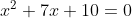

[`Lenguajes de Programación`](../README.md) > `Sesión 3`

## Sesión 3: Estructuras de Datos


__Haskell__ cuenta con varias bibliotecas para usar estructuras de datos, tales como árboles, pilas, colas, tablas de
dispersión, entre otras. Sin embargo, las dos estructuras de datos más usadas son las *tuplas* y las *listas* que se
incluyen dentro del preludio de __Haskell__.

### :dart: <ins>Tuplas</ins>

Una *tupla* es una estructura que almacena dos o más datos, no necesariamente del mismo tipo. Se delimitan por 
paréntesis y sus valores se separan por comas. Una vez que una tupla es definida, su número de elementos (tamaño) no
puede cambiar.

---

:pencil: **Ejemplo.** En el siguiente código, se muestra la definición de la función que resuelve una ecuación de segundo grado
por medio de la fórmula general, dados los valores de `a`, `b` y `c`:


Los resultados de la ecuación se regresan en una tupla de tamaño dos llamadas pares (líneas 4 y 5). La ejecución del
código muestra el resultado de resolver la ecuación



obteniendo los resultados


representados mediante la tupla `(-2.0, -5.0)`.

```haskell
-- Función que resuelve una ecuación de segundo grado
ecCuad :: Float -> Float -> Float -> Float
ecCuad a b c = (((b*(-1)) + (sqrt (b**2-4a*c))) / (2*a),
                 (b*(-1)) - (sqrt (b**2-4*a*c))) (2*a))
```

```
*Ejemplo1> ecCuad 1 7 10
(-2.0, -5.0)
```

---

> :rocket: **Actividad**
Abre el intérprete de __Haskell__, carga el archivo [`Ejemplo1.hs`](codigos/Ejemplo1.hs), observa la sintaxis y 
experimenta ejecutando la función `areaTotal` modificada.

---

Algunas funciones que operan sobre pares.

`fst` - Extrae el primer elemento de un par   
`snd` - Extrae el segundo elemento de un par   
`swap` - Intercambia los elementos de un par

---

> :rocket: **Actividad**
Abre el intérprete de __Haskell__, define algunos pares y prueba estas funciones con ellos.

---

### :dart: <ins>Listas</ins>

En __Haskell__ una lista se define como sigue:

---

> :green_book: **Definición.** Una lista es alguna de las siguientes:   
> 1. La lista vacía es una lista y se representa por `[]`.
> 1. Si *x* es un elemento de un conjunto *A* y *xs* es una lista con elementos en *A*, entonces `x:xs` es también una 
lista. Se llama a `x` la cabeza de la lista y a `xs` la cola.
> 1. Son todas.

---

En su forma más simple, una *lista* es una estructura que almacena varios datos, todos del mismo tipo. Se delimitan por
corchetes y sus valores se separan por comas. Para construir listas se usa la función `cons` (`:`). Una lista de 
caracteres es en realidad una cadena.

```
[1,2,3,4,5]    1:(2:(3:(4:[])))     "Ciencia"   [(1,2),(3,4)]     []
```

Otra forma de especificar listas numéricas es mediante lo que se conoce como *rango*, indicando los primeros y último
elemento de la lista o sólo los primeros separados por dos puntos (`..`).

```
Prelude> [1..10]
[1,2,3,4,5,6,7,8,9,10]
Prelude> [0,2..10]
[0,2,4,6,8,10]
Prelude> [1..]
[1,2,3,4,5,6,7,8,9,10,11,12,13,...
```

Al indicar más de un elemento al inicio de un rango, __Haskell__ infiere si se debe seguir algún patrón para generar la
lista, sin embargo, sólo funciona con patrones sencillos, como la lista con el cuadrado de los números naturales.

Otra forma de representar listas es *por comprensión*, al igual que en los conjuntos matemáticos, a partir de otros ya
existentes. Por ejemplo, el conjunto


produce el conjunto *{2,4,6,8,10}*, es decir, el conjunto de números *2x*, tal que x es un elemento del conjunto 
*{1,2,3,4,5}*.

En __Haskell__ se tiene una notación por comprensión similar que se puede usar para construir nuevas listas a partir de 
otras ya existentes. Por ejemplo:

```
Prelude> [2*x | x <- [1..5]]
[2,4,6,8,10]
Prelude> [even y | y <- [2..6]]
[True,False,True,False,True]
```

Las expresiones `x <- [1..5]` y `y <- [2..6]` son llamadas *generadores* y se puede tener más de uno dentro de las 
listas por comprensión, separando éstos por comas. La sintaxis de un generador puede ser alguna de las siguientes:

```
<variable> <- <variable>
(<variable>,<variable>) <- <lista de pares>
(<variable>,<variable>,<variable>) <- <lista de tuplas de tamaño 3>
...
```

También se pueden emplear guardias para filtar los valores producidos por los generadores. Si la guardia es verdadera,
entonces se mantiene el valor en la lista, en caso contrario, se descarta.

---

> :rocket: **Actividad**
Abre el intérprete de __Haskell__ y prueba todas las expresiones que hemos explicado. Trata de deducir el resultado por
ti mismo antes de ejecutar cada expresión.

---

:pencil: **Ejemplo.** En el siguiente código se define una función que obtiene los factores de un número entero. 
La lista se genera por comprensión en la línea 3, indicando un generador que toma valores de 1 a *n* (`[1..n]`) con la
condición de que el módulo de cada elemento de la lista sea igual a cero (su residuo es cero y por lo tanto no son
factores). La ejecución de la función muestra los factores del número 10, la lista por comprensión resultante queda
como sigue:

```
[x | x <- [1..10], mod 10 x == 0]
```

```haskell
-- Función que obtiene los factores de un número entero.
factores :: Int -> [Int]
factores n = [x | x <- [1..n], mod n x == 0]
```

```
Ejemplo2> factores 10
[1,2,5,10]
```

---

---

> :rocket: **Actividad**
Abre el intérprete de __Haskell__, carga el archivo [`Ejemplo2.hs`](codigos/Ejemplo2.hs), observa la sintaxis y 
experimenta ejecutando la función `areaTotal` modificada.

---

Algunas funciones que operan sobre listas:

`head` - Obtiene la cabeza de la lista   
`tail` - Obtiene el resto de la lista   
`last` - Obtiene el último elemento de la lista   
`init` - Quita el último elemento de la lista   
`length` - Calcula la longitud de la lista   
`null` - Indica si la lista es vacía   
`reverse` - Obtiene la reversa de la lista   
`take` - Toma los primeros *n* elementos de la lista   
`drop` - Elimina los primeros *n* elementos de la lista   
`elem` - Indica si un dato pertenece a la lista    

--- 

> :rocket: **Actividad**
Abre el intérprete de __Haskell__, define algunas listas y prueba estas funciones con ellos. Puedes revisar esta
referencia para conocer su documentación: https://hoogle.haskell.org/.

---

[`Anterior`](../sesion02/README.md) | [`Siguiente`](../sesion04/README.md)