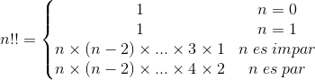
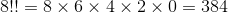
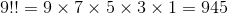

[`Lenguajes de Programación`](../README.md) > `Sesión 5`

## Sesión 6: Recursión

Manuel Soto Romero · *27 de marzo de 2020*

### Introducción


<div style="text-align: justify;">

La *recursión* es un método de definición donde el término a definir se encuentra en la definición misma. Pueden ser
definiciones formales, funciones o tipos de datos. En el 
<a href="https://drive.google.com/open?id=11hPg9-duJeW_5PshoMPOFU3ma3686Iyt">Complemento a la Nota de Clase 6</a> se
muestran algunas de estas definiciones:

- Números naturales

   - El cero es un número natural.
   - Si `n` es un número natural, entonces `s(n)` también lo es.
   - Son todas.

- Listas

   - La lista vacía es una lista.
   - Si `xs` es una lista, entonces `x:xs` también lo es.
   - Son todas.

- Árboles binarios

	- El árbol vacío es un árbol.
	- Si `t1` y `t2` son árboles binarios, entonces `tree(t1,e,t2)` es un árbol.
	- Son todos.

En esta sesión implementaremos algunas funciones sobre estos tipos de datos.	

---

#### Ejemplo 1.
En las funciones sobre números naturales, dado que __Haskell__ no incluye este tipo de dato, usaremos el tipo de dato 
`Int`, suponiendo que el usuario siempre intrducirá números naturales (mayores o iguales a cero). Por ejemplo, el 
*doble factorial* de un número `n` se define por:



Por ejemplo,

   



Notamos que sin importar si el número es par o impar, la llamada recursiva continúa restando dos al número. Definimos 
entonces una función recursiva que realice este cálculo.

```haskell
dobleFactorial :: Int -> Int
dobleFactorial 0 = 1
dobleFactorial 1 = 1
dobleFactorial n = n * dobleFactorial (n-2)
```

```
Sesion6> dobleFactorial 8
384
Sesion6> dobleFactorial 9
945
```

---

#### Ejemplo 2.
Dado un número `n` y una lista `l`, definir una función que obtenga el elemento en la posición `n` de la lista `l`. 
Recordemos que para definir funciones sobre listas se usan los patrones: `[]` y `(x:xs)`.

```haskell
obtenElem :: Int -> [a] -> a
obtenElem _ [] = error "Lista vacía"
obtenElem 0 (x:xs) = x
obtenElem n (x:xs) = obtenElem (n-1) xs
```

```
Sesion6> obtenElem 3 [1,2,3,4,5]
4
```

---

#### Ejemplo 3.
Para definir funciones sobre árboles binarios es necesario crear este tipo de dato pues __Haskell__ no incluye una 
definición para el mismo. Podemos definir tipos de datos mediante los valore que pertenecen al tipo de dato 
(*constructores*) y las operaciones asociadas al mismo.

Por ejemplo, si quisiéramos definir el tipo de dato `Natural`, debemos proporcionar un constructor para el cero y uno 
para la función sucesor. Las operaciones asociadas, se representan con funciones, por ejemplo:

```haskell
suma :: Natural -> Natural -> Natural
producto :: Natural -> Natural -> Natural
```

Para implementar el tipo de dato en __Haskell__ se usa la primitivia `data` usando lo que llamamos *constructor de 
datos* y *constructor de tipo*. Por ejemplo:

*Tipo `Natural`*

```haskell
data Natural = Cero 
             | Suc Natural
             deriving(Show)
```

- Todo lo que se encuentra antes del símbolo `=` es un constructor de tipo, y lo que se encuentra a la derecha son 
contructores de datos. Cada constructor se separa con `|`.

- Los constructores de tipo, pueden recibir tipos de datos como parámetro. En el caso del tipo `Natural` no tenemos 
ninguno.

- Los constructores de datos, también reciben tipos de datos como parámetros, por ejemplo el constructor `Suc` recibe un 
parámetro de tipo `Natural`, lo cual corresponde con la definición formal de los naturales.

- La última parte, `deriving Show` permite mostrar el tipo de dato en el intérprete. No te preocupes por eso de momento, 
más adelante lo explicaremos con más detalle.

Para usar el tipo de dato, escribimos:

```
Sesion6> Cero
Cero
Sesion6> Suc (Cero)
Suc (Cero)
Sesion6> Suc (Suc (Cero))
Suc (Suc (Cero))
```

Con esto dicho, podemos definir ahora el tipo de dato `ArbolB` como se muestra a continuación:

```haskell
data ArbolB a = Void
              | Tree ArbolB a ArbolB
              deriving(Show)
```

En este caso, el constructor de tipo recibe un parámetro `a` que indica que podemos tener árboles de cualquier tipo. Lo
cual se aprecia en la definición del constructor `Tree`.

Ahora, podemos definir funciones usando patrones como en el caso de la listas. Por ejemplo, queremos una función que
genere una lista con los elementos de las hojas del árbol.

```haskell
elementos :: ArbolB a -> Int
elementos Void = 0
elementos (Tree Void e Void) = [e]
elementos (Tree t1 e t2) = elementos t1 ++ elementos t2
```

```
Sesion6> let arbol = Tree (Tree Void 2 Void) 1 (Tree Void 3 Void)
Sesion6> elementos arbol
[2,3]
```

---

### Actividad 6


Usando listas y la definición de árboles binarios, definir una función `aplana` que dado un árbol binario regrese la 
lista de elementos del mismo. Se debe tener el orden: raíz, subárbol izquierdo, subárbol derecho (*inorder*).

```haskell
aplana :: ArbolB a -> [a]
aplana a = ...
```

Por ejemplo:

```
Sesion6> let arbol = Tree (Tree Void 2 Void) 1 (Tree Void 3 Void)
Sesion6> aplana arbol
[1,2,3]
```

**Fecha de entrega:** 31 de marzo de 2020

</div>

`Anterior` | `Siguiente`